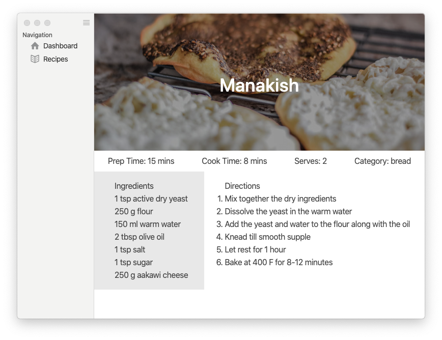

# Live To Eat

[](https://coveralls.io/github/mohammadmoustafa/live2eat?branch=master)

[](https://github.com/mohammadmoustafa/live2eat/blob/master/LICENSE)

> A app for storing your favourite recipes and conveniently changing portion sizes on the fly.



**README still needs updating, not currently accurate**

## Install

*Currently only supports macOS 10.10+.*

**macOS**

[**Download**](https://github.com/mohammadmoustafa/live2eat/releases/latest) the `.dmg` file.

---


## Dev

Built with [Electron](https://electronjs.org).

### Run

```
$ npm install
$ npm start
```
